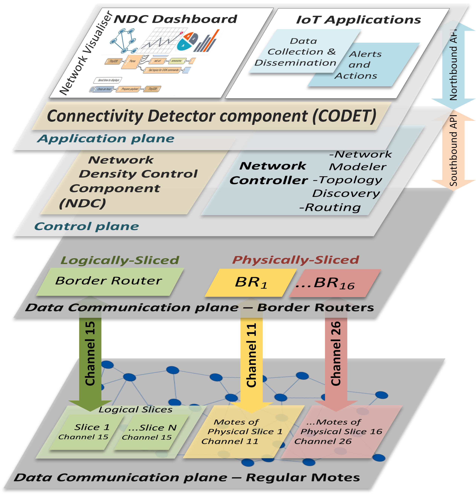

# DENIS-SDN
DENIS-SDN: Software-Defined Network Slicing Solution for Dense and Ultra-Dense IoT Networks

Traditional Wireless Sensor Networks protocols used in Internet of Things Networks (IoTNs) today face challenges in high- and ultra-density network topology conditions. New networking paradigms like Software-Defined Networks (SDN) have emerged as an up-and-coming approach to address IoT application requirements through implementing global protocol strategies and network programmability. This paper proposes a divide-and-conquer solution that aims to improve the PDR in ultra-dense IoT (UDIoT) network environments using network slicing. As such, we develop and evaluate DENIS-SDN, an open-source SDN solution for UDIoT Network environments consisting of a modular SDN controller and an OpenFlow-like data-plane protocol. DENIS-SDN utilizes our Network Density Control mechanism based on operational specification requirements, which address the challenges UDIoT network deployments pose, including interference, congestion, resource management, control, and quality of service (QoS) performance issues. To achieve this, it divides dense IoT networks into either logically sliced subnetworks separating nodes using routing rules or physically sliced sub-networks separating nodes into different radio channels. We provide evaluation results over realistic scenarios demonstrating improved PDR performance up to 4.8% for logically and up to 11.6% for physically sliced network scenarios.

